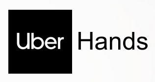

<!--
*** Thanks for checking out the Best-README-Template. If you have a suggestion
*** that would make this better, please fork the repo and create a pull request
*** or simply open an issue with the tag "enhancement".
*** Don't forget to give the project a star!
*** Thanks again! Now go create something AMAZING! :D
-->

<!-- PROJECT SHIELDS -->
<!--
*** I'm using markdown "reference style" links for readability.
*** Reference links are enclosed in brackets [ ] instead of parentheses ( ).
*** See the bottom of this document for the declaration of the reference variables
*** for contributors-url, forks-url, etc. This is an optional, concise syntax you may use.
*** https://www.markdownguide.org/basic-syntax/#reference-style-links
-->
[![Contributors][contributors-shield]][contributors-url]
[![Forks][forks-shield]][forks-url]
[![Stargazers][stars-shield]][stars-url]
[![Issues][issues-shield]][issues-url]
[![MIT License][license-shield]][license-url]
[![LinkedIn][linkedin-shield]][linkedin-url]

<!-- PROJECT LOGO -->
 

  

  <h3 align="center">Uber Hands</h3>

  

     A helping hand near you
     
     
    <a href="https://uberhands.netlify.app/">View Demo</a>
    ·
    <a href="https://github.com/UberHands/UberHands_Client/issues">Report Bug</a>
    ·
    <a href="https://github.com/UberHands/UberHands_Client/issues">Request Feature</a>
  

<!-- TABLE OF CONTENTS -->

  
Table of Contents

  <ol>
    <li>
      <a href="#about-the-project">About The Project</a>
      <ul>
        <li><a href="#built-with">Built With</a></li>
      </ul>
    </li>
    <li><a href="#contact">Contact</a></li>
  </ol>

<!-- ABOUT THE PROJECT -->
## About The Project

[![Uber Hands][product-screenshot]](https://example.com)

Uber Hands is a demo project created for Uber HackTag 2.0 . Uber wants to reach a billion customer and for that we need to simplify a common problem that is faced by billions of people in this country. Uber hands in its idea simplifies such situations for us where we need a helping hand to assist us or to fill in for us or to get a job done. It identifies "Help-Seeker" as people who require help/assistance to get their specific task done. It also idenifies "Help provider" who generally don't have some specific skill set or they have some time left in their day when they can work extra (on task-basis) to earn some money.

Here's what Uber Hand aim to provide :
* A fast and efficient on-demand employment providing platform
* Convenience of calling a helping hand with an app
* Bridge between Employment Seekers and Help Seekers
* Facility to hold direct communication between both parties
* Coherent strategy to satisfy both demand and supply

(<a href="#top">back to top</a>)

### Built With

Following are the Libraries/Framework used for development purpose :

* [React.js](https://reactjs.org/)
* [Material UI](https://mui.com/)
* [Font Awesome](https://fontawesome.com/)

(<a href="#top">back to top</a>)

<!-- CONTACT -->
## Contact

[@Sujal Modanwal](https://www.linkedin.com/in/sujal-modanwal/)
[@Kamal Pathak](https://www.linkedin.com/in/kamal-pathak-8b5140169/)
[@Nikhil Joshi](https://www.linkedin.com/in/nikhil-joshi-/)

Project Link: [https://github.com/UberHands](https://github.com/your_username/repo_name)

(<a href="#top">back to top</a>)

<!-- MARKDOWN LINKS & IMAGES -->
<!-- https://www.markdownguide.org/basic-syntax/#reference-style-links -->
[contributors-shield]: https://img.shields.io/github/contributors/othneildrew/Best-README-Template.svg?style=for-the-badge
[contributors-url]: https://github.com/UberHands/UberHands_Client/graphs/contributors
[forks-shield]: https://img.shields.io/github/forks/othneildrew/Best-README-Template.svg?style=for-the-badge
[forks-url]: https://github.com/UberHands/UberHands_Client/network/members
[stars-shield]: https://img.shields.io/github/stars/othneildrew/Best-README-Template.svg?style=for-the-badge
[stars-url]: https://github.com/UberHands/UberHands_Client/stargazers
[issues-shield]: https://img.shields.io/github/issues/othneildrew/Best-README-Template.svg?style=for-the-badge
[issues-url]: https://github.com/UberHands/UberHands_Client/issues
[license-shield]: https://img.shields.io/github/license/othneildrew/Best-README-Template.svg?style=for-the-badge
[license-url]: https://github.com/othneildrew/Best-README-Template/blob/master/LICENSE.txt
[linkedin-shield]: https://img.shields.io/badge/-LinkedIn-black.svg?style=for-the-badge&logo=linkedin&colorB=555
[linkedin-url]: https://www.linkedin.com/in/sujal-modanwal/
[product-screenshot]: img/homePage.png
